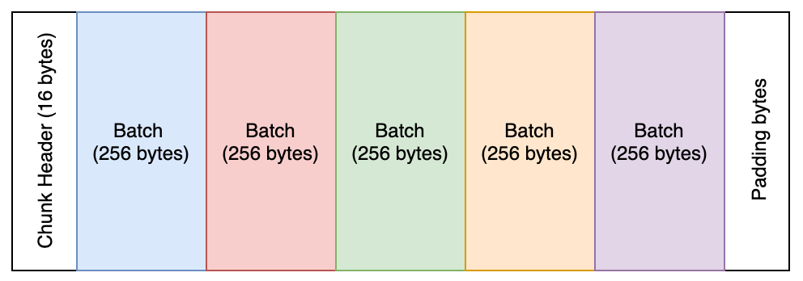

# T-boot bootloader

## Intro
T-boot is USB bootloader for STM32 MCUs. The initial intention to extract it into separate project/middleware in order to reuse it, keep clean documentation for bootloader itself, protocol and supported features. An additional purpose is stability and saving developing time for copying, adjusting it for any new project.

Many of Teufel's projects provide an update mechanism via USB interface.

The main features:
- easy to use
- clean and well structured
- minimal dependencies
- covered with unit tests
- end-to-end tests
- CI/CD integration
- supports encryption
- supports signature verification
- small footprint
- well documented

## Quick start and API description
T-boot is the middleware, so it has to be compiled and linked during the compilation time. It is presented as a few sources in middleware/t-boot, which must be included for the target project.

1. Include all files from middleware/t-boot into the target project
2. Copy template config file into the target project: cp middleware/t-boot/dfu_config_template.h Projects/<target_project>
3. Adjust config file for the target project needs
4. Provide DFU callbacks for every single dfu that must/can be updated

## Environment variables and settings
T-boot supports several parameters that can adjust its behavior, enable/disable certain features and configure interfaces and system options. It provides .conf file that should be located in the project's root directory. The template can be found in the t-boot location: middleware/t-boot/dfu_config_template.h.

### DFU settings

- `T_BOOT_LOAD_ADDRESS`: the address for update MCU firmware

### USB interface settings

- `USBD_PID`: product ID. Please, keep in mind, that VENDOR ID for all Teulfe's products is 0x2CC2
- `USBD_PRODUCT_FS_STRING`: product name representation
- `VOLUME_NAME`: mass storage device name representation

### Product settings

- `product_type_le`: Little endian ASCII representation of the product type, e.g. '\0\0AC'
- `product_id_le`: Little endian ASCII representation of the product id, e.g. '1901'

### T-boot options

- `T_BOOT_SKIP_SIGNATURE`: ignore signature verification
- `T_BOOT_SKIP_CRC_CHECK`: skip CRC checksum calculation for chunks/frames

## Protocol description
TODO.

## Batching and granularity
The chunk size in a concrete project may vary and often rely on the transport layer. For instance, if the transport is USB, then chunk size follows USB requirements, e.g., for high-speed endpoints, the typical size of the packet is 512 bytes.

On another side, a minimum amount of data for a single _write_ operation is a very common requirement from the hardware. SPI NOR flash, MCU flash, some EEPROMs, and many other devices have strict requirements for data granularity, e.g., erase granularity as small as 4KB for SPI memory flash, page sizes in EEPROMs, etc.

Because of these reasons batch feature was introduced. As an example, Figure 1 depicts chunk (1536 bytes) with 16 bytes header as described in the protocol specification. We know that hardware demands 256 bytes per write operation and we have 1536 bytes of the transmission channel.



Assume that hardware requires data granularity with 256 bytes. To fulfill these requirements, we can consider several options:

1. Shrink chunk size to 256+16 bytes and thus prevent the useless transfer of padding bytes.
2. Fit as many *batches* in the chunk as possible. It might be useful in those cases where reducing/changing chunk size isn't an option, or when the overhead of every single transaction is significant.

## Encryption
Transport protocol of t-boot supports different options of encryption. Due to restricted resources, it supports only simple symmetric encryption. Vineger cipher is the default one and only one method supported so far. Nonetheless, the protocol is flexible enough, hence it can be extended for any other encryption method.

## Signature
T-boot supports RSA signature option, which can be used for verification perpuse during update procedure.

### Prepare keys using OpenSSL
The following part introduces instructions on how to create the new keys by using the openssl utility.

T-boot already includes a private/public key pair for development. The keys are located in the `keys` directory.

```text
# Generate 1024 bit Private key
openssl genrsa -out teufel_dev_private.pem 1024

# Separate the public part from the Private key file
openssl rsa -in teufel_dev_private.pem -outform PEM -pubout -out teufel_dev_public.pem

# Sign the file /tmp/mcu.bin using sha1 digest scheme
openssl dgst -sha1 -sign teufel_dev_private.pem -out teufel_dev_sign.sha1 /tmp/mcu.bin

# Get modulus and exponent from private key
openssl rsa -text -in teufel_dev_private.pem
```

## Tooling
T-boot provides a basic script to prepare an update image from original binary files.

The file located in `scripts/prepare_update.py` and requires a Python 3.x interpreter.

**Dependencies**:
- `openssl`: better look in Google how to install this for your particular operating system.
- `crcmod`: a Python package available in `pip`.

It has one dependency for CRC calculations, the `crcmod` Python package. You can install this dependency using e.g. `pip install crcmod`.

## Prepare and Verify FAT16 fs
These notices how to prepare boot sector, fat table and init DirSector for t-boot's ramdisk.
It's obvious that it's not necessary to do for normal usage, but only in the global restructuring of FS representing and configuration.

To create and test filesystem on Linux machine initial file with zero/random data must be prepared:
```text
# # ~16 MBytes prepared file
# dd if=/dev/zero of=fat.fs bs=1024 count=16384
```

Once the file is prepared mkfs util can be used to create initial filesystem. Flags can be adjusted for specific needs.

```text
# mkfs.msdos -F 16 -f 2 -r 512 -R 1 -s 1 -n "TEUFEL" fat.fs
```
**WARNING!**: mkfs.msdos and mkfs.vfat creates FS with the value **sector per FAT = 127 (0x7f)**, which must be adjusted manually!

The simplest way to verify the prepared filesystem is by using minfo utility. Here is an example of the output:

```text
# minfo -i fat.fs -v 79 20 61 6e 64 0d 0a 70 72 e floppy and..pr
0a0  65 73 73 20 61 6e 79 20 6b 65 79 20 74 6f 20 74 ess any key to t
0b0  72 79 20 61 67 61 69 6e 20 2e 2e 2e 20 0d 0a 00 ry again ... ...
0c0  00 00 00 00 00 00 00 00 00 00 00 00 00 00 00 00 ................
0d0  00 00 00 00 00 00 00 00 00 00 00 00 00 00 00 00 ................
0e0  00 00 00 00 00 00 00 00 00 00 00 00 00 00 00 00 ................
0f0  00 00 00 00 00 00 00 00 00 00 00 00 00 00 00 00 ................
100  00 00 00 00 00 00 00 00 00 00 00 00 00 00 00 00 ................
110  00 00 00 00 00 00 00 00 00 00 00 00 00 00 00 00 ................
120  00 00 00 00 00 00 00 00 00 00 00 00 00 00 00 00 ................
130  00 00 00 00 00 00 00 00 00 00 00 00 00 00 00 00 ................
140  00 00 00 00 00 00 00 00 00 00 00 00 00 00 00 00 ................
150  00 00 00 00 00 00 00 00 00 00 00 00 00 00 00 00 ................
160  00 00 00 00 00 00 00 00 00 00 00 00 00 00 00 00 ................
170  00 00 00 00 00 00 00 00 00 00 00 00 00 00 00 00 ................
180  00 00 00 00 00 00 00 00 00 00 00 00 00 00 00 00 ................
190  00 00 00 00 00 00 00 00 00 00 00 00 00 00 00 00 ................
1a0  00 00 00 00 00 00 00 00 00 00 00 00 00 00 00 00 ................
1b0  00 00 00 00 00 00 00 00 00 00 00 00 00 00 00 00 ................
1c0  00 00 00 00 00 00 00 00 00 00 00 00 00 00 00 00 ................
1d0  00 00 00 00 00 00 00 00 00 00 00 00 00 00 00 00 ................
1e0  00 00 00 00 00 00 00 00 00 00 00 00 00 00 00 00 ................
1f0  00 00 00 00 00 00 00 00 00 00 00 00 00 00 55 aa ..............U.
device information:
===================
filename="fat.fs"
sectors per track: 32
heads: 64
cylinders: 16

mformat command line: mformat -t 16 -i fat.fs  -h 64 -s 32 ::

bootsector information
======================
banner:"mkfs.fat"
sector size: 512 bytes
cluster size: 1 sectors
reserved (boot) sectors: 1
fats: 2
max available root directory slots: 512
small size: 32768 sectors
media descriptor byte: 0xf8
sectors per fat: 127
sectors per track: 32
heads: 64
hidden sectors: 0
big size: 0 sectors
physical drive id: 0x80
reserved=0x0
dos4=0x29
serial number: 645D18D8
disk label="TEUFEL     "
disk type="FAT16   "

Boot sector hexdump:
000  eb 3c 90 6d 6b 66 73 2e 66 61 74 00 02 01 01 00 .<.mkfs.fat.....
010  02 00 02 00 80 f8 7f 00 20 00 40 00 00 00 00 00 ........ .@.....
020  00 00 00 00 80 00 29 d8 18 5d 64 54 45 55 46 45 ......)..]dTEUFE
030  4c 20 20 20 20 20 46 41 54 31 36 20 20 20 0e 1f L     FAT16   ..
040  be 5b 7c ac 22 c0 74 0b 56 b4 0e bb 07 00 cd 10 .[|.".t.V.......
050  5e eb f0 32 e4 cd 16 cd 19 eb fe 54 68 69 73 20 ^..2.......This
060  69 73 20 6e 6f 74 20 61 20 62 6f 6f 74 61 62 6c is not a bootabl
070  65 20 64 69 73 6b 2e 20 20 50 6c 65 61 73 65 20 e disk.  Please
080  69 6e 73 65 72 74 20 61 20 62 6f 6f 74 61 62 6c insert a bootabl
090  65 20 66 6c 6f 70 70 79 20 61 6e 64 0d 0a 70 72 e floppy and..pr
0a0  65 73 73 20 61 6e 79 20 6b 65 79 20 74 6f 20 74 ess any key to t
0b0  72 79 20 61 67 61 69 6e 20 2e 2e 2e 20 0d 0a 00 ry again ... ...
0c0  00 00 00 00 00 00 00 00 00 00 00 00 00 00 00 00 ................
0d0  00 00 00 00 00 00 00 00 00 00 00 00 00 00 00 00 ................
0e0  00 00 00 00 00 00 00 00 00 00 00 00 00 00 00 00 ................
0f0  00 00 00 00 00 00 00 00 00 00 00 00 00 00 00 00 ................
100  00 00 00 00 00 00 00 00 00 00 00 00 00 00 00 00 ................
110  00 00 00 00 00 00 00 00 00 00 00 00 00 00 00 00 ................
120  00 00 00 00 00 00 00 00 00 00 00 00 00 00 00 00 ................
130  00 00 00 00 00 00 00 00 00 00 00 00 00 00 00 00 ................
140  00 00 00 00 00 00 00 00 00 00 00 00 00 00 00 00 ................
150  00 00 00 00 00 00 00 00 00 00 00 00 00 00 00 00 ................
160  00 00 00 00 00 00 00 00 00 00 00 00 00 00 00 00 ................
170  00 00 00 00 00 00 00 00 00 00 00 00 00 00 00 00 ................
180  00 00 00 00 00 00 00 00 00 00 00 00 00 00 00 00 ................
190  00 00 00 00 00 00 00 00 00 00 00 00 00 00 00 00 ................
1a0  00 00 00 00 00 00 00 00 00 00 00 00 00 00 00 00 ................
1b0  00 00 00 00 00 00 00 00 00 00 00 00 00 00 00 00 ................
1c0  00 00 00 00 00 00 00 00 00 00 00 00 00 00 00 00 ................
1d0  00 00 00 00 00 00 00 00 00 00 00 00 00 00 00 00 ................
1e0  00 00 00 00 00 00 00 00 00 00 00 00 00 00 00 00 ................
1f0  00 00 00 00 00 00 00 00 00 00 00 00 00 00 55 aa ..............U.
```
Boot sector hexdump (512 Bytes) can be copied and used for RAM_DISK implementation.

To get fat table of prepared FS hexdump util can be used. For example:

```text
# # Fat table starts from the secod sector, i.g. the offset should be 512 bytes.
# # The size of fat table is 512 bytes.
# hexdump -s 512 -C -n 512 fat.fs
```
DirSector can be found by using hexdump with "wider" parameters, e.g. hexdump -s 512 -C -n 32000 fat.fs. The location depends on many factors and can be flexible.

## To-Do list
- Add self-update mechanism
- Improve documentation
